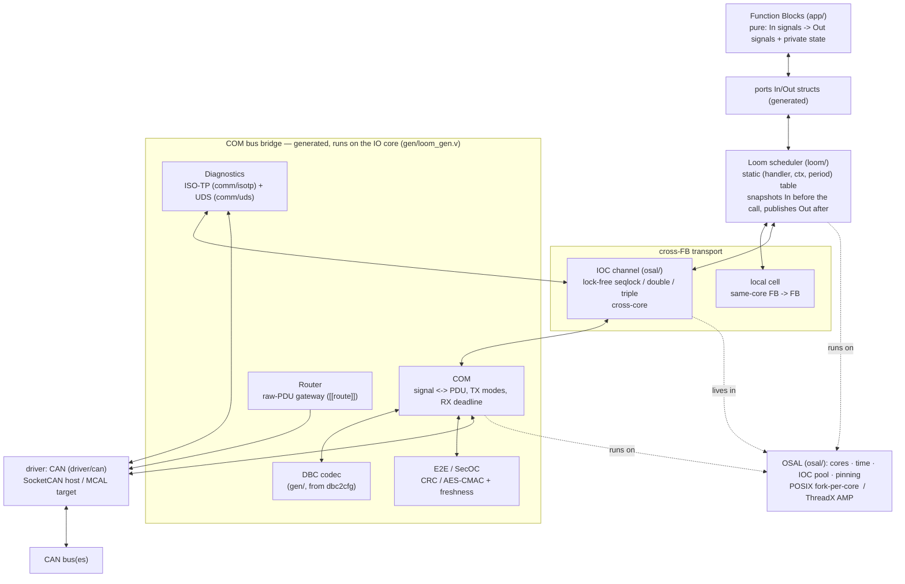
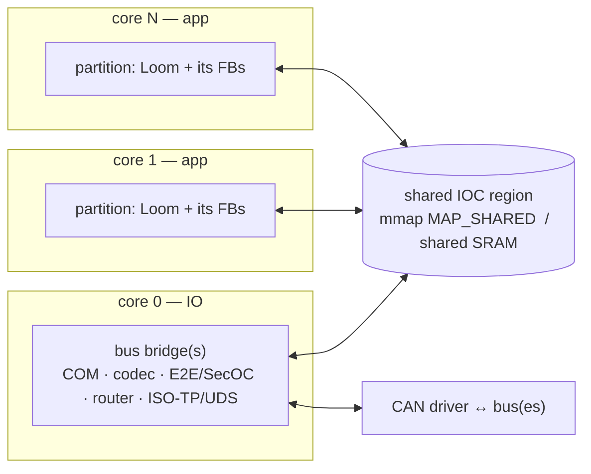
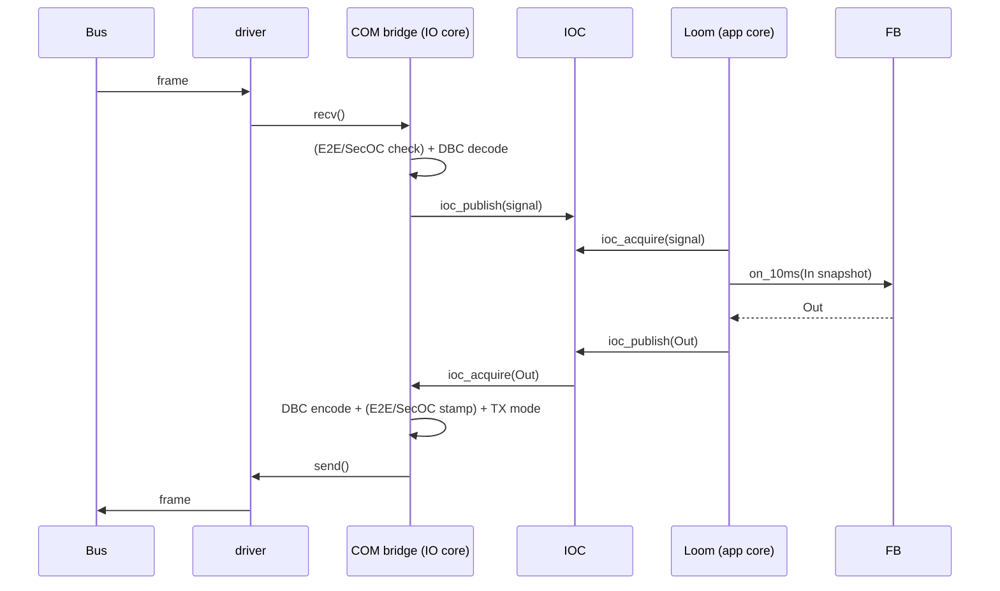

# Architecture overview

How the pieces fit: what a Function Block talks to, where COM / the Loom /
diagnostics sit, and how a signal travels from the bus to an FB and back. For the
*why* behind each piece see `application-model.md`, `communication.md`,
`multicore-perf.md`; this is the map that ties them together.

## The stack

Read it top-down: an **FB** only ever touches its **ports**; the **Loom** moves data
between ports and the **transport** (a local cell, or an **IOC** channel across
cores); the **COM bridge** is the only thing that touches the **driver** and the
**bus**. Everything in the bridge box is generated and runs on the IO core.

## Who talks to what

| Component | Talks to | How / via | Purpose |
|---|---|---|---|
| **Function Block** | its `ports` In/Out only | typed fields | pure transform; knows nothing of buses, cores, or other FBs |
| **Loom** | FB handlers; IOC / local cells | snapshot In → call handler → publish Out | dispatch on a period; coherent input snapshot |
| **IOC** | the Loom (app side), the COM bridge (IO side) | `ioc_read/acquire` + `ioc_write/publish` | lock-free cross-core signal transport |
| **local cell** | the Loom only | direct struct field | same-core FB→FB, no sync |
| **COM** | IOC (signals), DBC codec, E2E/SecOC, driver | encode/decode + send/recv | signal⇄PDU, TX modes, RX deadline |
| **DBC codec** | COM | generated `*_phys` / `*_set` over `[64]u8` | raw↔physical bit packing |
| **E2E / SecOC** | COM (the frame bytes) | `protect` on tx, `check`/`verify` on rx | integrity (CRC) / authenticity (MAC) |
| **Router** | the driver of another bus | forward the raw frame | gateway, no decode |
| **ISO-TP / UDS** | IOC (read live signals), driver (the diag frames) | reassemble → dispatch → segment | diagnostics request/response |
| **driver** | the COM bridge; the bus | `open/send/recv` C shim | the only hardware-touching layer |
| **OSAL** | Loom, bridge, IOC | cores, time, the shared IOC region, pinning | the platform line: POSIX or ThreadX AMP |

The two hard boundaries: an **FB never reaches past its ports** (no driver, no IOC,
no other FB), and only the **bridge + `main.v`** touch the **driver**. Everything
else is platform-independent V above the OSAL/driver line.

## Runtime topology (who runs where)

Each **partition** is one OS task pinned to a core (a forked process on host, a
ThreadX task on target) running a **Loom** that dispatches that partition's FBs. The
**bus bridges** run on the IO core (one per bus). The only shared memory is the
**IOC region**; cross-core signals cross there and nowhere else (the basis for MPU
isolation — see `memory-protection.md`).

## Data-flow paths

**Bus → FB (rx).** `driver.recv` a frame → COM matches the id → (E2E/SecOC verify)
→ DBC-decode each signal → `ioc_publish` to the channel → next cycle the **Loom**
snapshots it into the consumer FB's In port → the FB reads it in physical units.

**FB → bus (tx).** The FB writes its Out port → the **Loom** `ioc_publish`es it →
the bridge `ioc_acquire`s it → DBC-encode into the frame → (E2E/SecOC stamp) → the
PDU's **TX mode** decides whether to send → `driver.send`.

**FB → FB.** Same core → a **local cell** (direct copy in the partition state, no
sync). Different cores → an **IOC channel** (the Loom publishes/acquires; the
transport — seqlock/double/triple — is per-channel config).

**Diagnostics.** Frames on the diag id → **ISO-TP** reassembles a request → **UDS**
dispatches it; a ReadDataByIdentifier mapped to a live signal `ioc_acquire`s it from
the same IOC the FBs use → the response is re-segmented and sent. So a tester reads
an FB's output straight off the IOC.

**Gateway.** A frame on bus A whose id matches a `[[route]]` is handed straight to
bus B's channel and re-sent — never decoded to signals.

## Where each piece lives

| Layer | Directory | Hand / generated |
|---|---|---|
| Application | `app/` (per example) | hand (one file per FB) |
| Signal types / ports | `sig/`, `ports/` | generated (`loom2v`) |
| Codec / bridge / glue / tables | `gen/` | generated (`dbc2cfg`, `cfg2v`, `loom2v`) |
| Scheduler | `loom/` | framework |
| Comms | `comm/com`, `comm/e2e`, `comm/secoc`, `comm/isotp`, `comm/uds`, `comm/nm` | framework |
| Platform line | `osal/` (cores/time/IOC), `driver/` (CAN) | framework + C shims |
| Entry | `main.v` | hand (tiny: open channels, `gen.run`) |

The build-time generators in `tools/` (`dbc2cfg`, `cfg2v`, `loom2v`, `sigmap`) turn
the config + DBC into the `sig/ports/gen` code; see `ways-of-working.md` for how
teams operate around that, and `configuration.md` for what each config section
generates.
