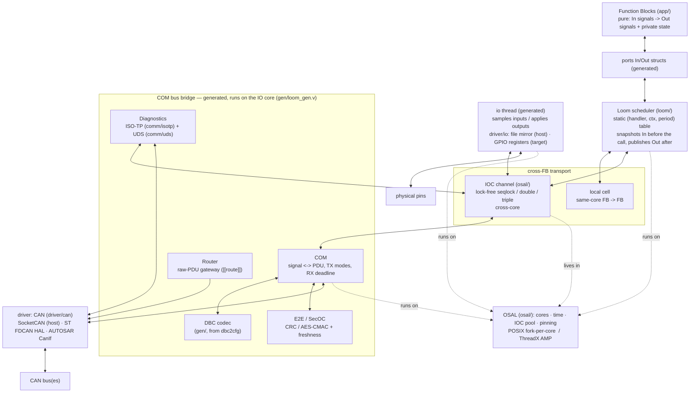
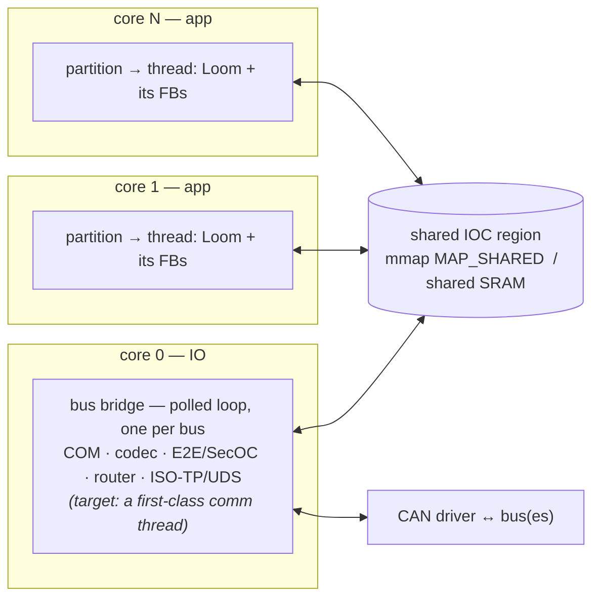
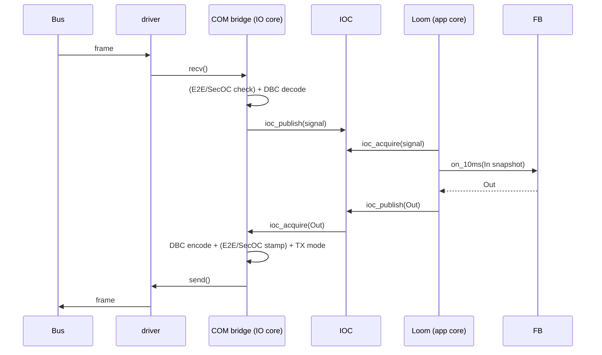
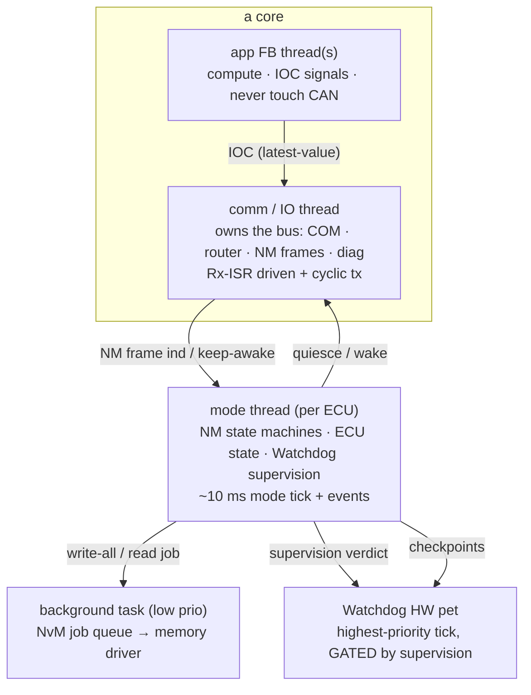

# Architecture overview

How the pieces fit: what a Function Block talks to, where COM / the Loom /
diagnostics sit, and how a signal travels from the bus to an FB and back. For the
*why* behind each piece see `application-model.md`, `communication.md`,
`multicore-perf.md`; this is the map that ties them together.

## The stack



Read it top-down: an **FB** only ever touches its **ports**; the **Loom** moves data
between ports and the **transport** (a local cell, or an **IOC** channel across
cores); the **COM bridge** is the only thing that touches the **driver** and the
**bus**. Everything in the bridge box is generated and runs on the IO core.

## Who talks to what

| Part | Talks to | How / via | Purpose |
|---|---|---|---|
| **Function Block** | its `ports` In/Out only | typed fields | pure transform; knows nothing of buses, cores, or other FBs |
| **Loom** | FB handlers; IOC / local cells | snapshot In → call handler → publish Out | dispatch on a period; coherent input snapshot |
| **IOC** | the Loom (app side), the COM bridge (IO side) | `ioc_read/acquire` + `ioc_write/publish` | lock-free cross-core signal transport |
| **local cell** | the Loom only | direct struct field | same-core FB→FB, no sync |
| **COM** | IOC (signals), DBC codec, E2E/SecOC, driver | encode/decode + send/recv | signal⇄PDU, TX modes, RX deadline |
| **DBC codec** | COM | generated `*_phys` / `*_set` over `[64]u8` | raw↔physical bit packing |
| **E2E / SecOC** | COM (the frame bytes) | `protect` on tx, `check`/`verify` on rx | integrity (CRC) / authenticity (MAC) |
| **Router** | the driver of another bus | forward the raw frame | gateway, no decode |
| **ISO-TP / UDS** | IOC (read live signals), driver (the diag frames) | reassemble → dispatch → segment | diagnostics request/response |
| **driver** | the COM bridge; the bus | `open/send/recv` C shim | the only bus-hardware layer |
| **io thread** | IOC (signals); `driver/io` (pins) | sample-and-publish / acquire-and-apply per point | physical IO as signal endpoints (docs/io.md); the only pin-touching thread |
| **OSAL** | Loom, bridge, IOC | cores, time, the shared IOC region, pinning | the platform line: POSIX or ThreadX AMP |

The hard boundaries: an **FB never reaches past its ports** (no driver, no IOC,
no other FB); only the **bridge + `main.v`** touch the **bus driver**; and only
the generated **io thread** touches `driver/io` — application partitions have no
peripheral access (docs/io.md, docs/memory-protection.md). Everything
else is platform-independent V above the OSAL/driver line.

## Runtime topology (who runs where)



Each **partition** is the unit of **MPU isolation**, pinned to a core; inside it runs one
or more **threads** — the OS scheduling unit (a spawned loop on host, a ThreadX thread on
target) — each a **Loom** dispatching the FBs mapped to it. An **fb names a thread** (thread
names are globally unique, so the partition is *derived* — a thread belongs to one
partition); a handler's trigger is a **period** (dispatched on its thread) or an **interrupt**
(`irq`, ISR context). *(Today loom2v generates one thread per partition; multiple threads and
`irq` handlers are the target, not yet generated. The MPU boundary is enforced on the ThreadX
target and modeled by codegen convention on the host — see `memory-protection.md`.)*

Today the **bus bridge** runs as a **polled** per-bus loop on the IO core — it drains
`recv`, DBC-decodes rx into IOC, encodes tx from IOC, and serves ISO-TP/UDS + routing. The
**target** model makes it a first-class **comm thread** per bus (rx driven by the CAN **Rx
interrupt**, tx periodic) so that *every* thread — app **and** platform — appears in the
runtime trace **by name** and the platform is never hidden (bridge / ISO-TP overhead is often
where the time goes; see `telemetry.md`). *(The comm thread, its Rx-interrupt path, and its
manifest entry are all target — today the bridge polls and the manifest names app threads
only; NM is configured but not yet generated into the bridge.)* The only shared memory is the
**IOC region**; cross-core signals cross there and nowhere else (the basis for MPU isolation).

## Data-flow paths

**Bus → FB (rx).** `driver.recv` a frame → COM matches the id → (E2E/SecOC verify)
→ DBC-decode each signal → `ioc_publish` to the channel → next cycle the **Loom**
snapshots it into the consumer FB's In port → the FB reads it in physical units.

**FB → bus (tx).** The FB writes its Out port → the **Loom** `ioc_publish`es it →
the bridge `ioc_acquire`s it → DBC-encode into the frame → (E2E/SecOC stamp) → the
PDU's **TX mode** decides whether to send → `driver.send`.

**FB → FB.** Same core → a **local cell** (direct copy in the partition state, no
sync). Different cores → an **IOC channel** (the Loom publishes/acquires; the
transport — seqlock/double/triple — is per-channel config).

**Diagnostics.** Frames on the diag id → **ISO-TP** reassembles a request → **UDS**
dispatches it; a ReadDataByIdentifier mapped to a live signal `ioc_acquire`s it from
the same IOC the FBs use → the response is re-segmented and sent. So a tester reads
an FB's output straight off the IOC.

**Gateway.** A frame on bus A whose id matches a `[[route]]` is handed straight to
bus B's channel and re-sent — never decoded to signals.



## The management plane — platform services & scheduling

Everything above is the **data plane**: the high-rate signal path, FB → IOC → COM → bus,
cyclic and latest-value. Beside it runs the **management plane** — the services that decide
**mode** (NM, ECU state), guard **health** (Watchdog), and hold **state across power cycles**
(NvM). They run slower, are **event- and mode-driven**, and coordinate through **mode events
and requests, not signals**. The data plane asks "what is the value now?"; the management
plane asks "what should the ECU be *doing* now, and is it still healthy?".

| Service | Owns | Scheduled | Talks to |
|---|---|---|---|
| **COM / codec** | signal⇄PDU packing | in the comm thread (rx decode, tx encode) | IOC (signals), driver (PDUs) |
| **Router** | PDU destination (the rx demux) | in the comm thread, per received PDU | COM, other buses' comm threads, diag, NM |
| **NM** (`comm/nm` + `nm_can`) | per-network sleep/wake coordination | frames in the comm thread; **state machine on the mode tick** | NM frames (comm), keep-awake requests, ECU state |
| **ECU state** (mode manager) | ECU lifecycle: start → run → prep-sleep → sleep → shutdown | the mode tick + events | NM (sleep ind.), NvM (write-all), comm (quiesce), Watchdog |
| **Watchdog** (supervisor + HW) | liveness: checkpoint supervision → HW pet | supervision on the mode tick; **HW pet at highest priority** | every thread's checkpoints; the HW watchdog |
| **NvM** (persistent store) | blocks of persistent data + the async job queue | a **low-priority background task** | the memory driver (flash/EEPROM), ECU state |

### Where each runs — the recommended thread model

Extending "one I/O thread per core owns the buses", the recommendation is a **dedicated mode
thread**, so each concern has a single owner and appears in the trace by name:



- **app FB thread(s)** — data plane, per partition/core (as today).
- **comm / IO thread** — per core, owns the bus. Runs the *data-plane* comm work **and the
  NM frame tx/rx** (NM frames are just special PDUs). Rx-ISR driven + cyclic tx.
- **mode thread** — one per ECU. The *state machines*: NM (per network), ECU state, and
  Watchdog supervision, on a ~10 ms mode tick plus events.
- **background task** — low priority, drains the NvM job queue to the memory driver so flash
  latency never perturbs the data plane.
- **Watchdog HW pet** — highest-priority tick (or the timer ISR), **gated by** the supervisor's
  verdict: it only pets while every supervised thread is hitting its checkpoints.

**Why a dedicated mode thread** (over folding it into the comm thread): each plane keeps a
single owner — the comm thread owns the *bus*, the mode thread owns the *ECU state* — matching
the lock-free single-owner-per-core rule; the management plane stays **visible by name in the
trace** (the "platform is never hidden" principle); and it generalises to multi-core /
multi-network without entangling I/O with mode logic. The cost is one more thread and a second
IPC primitive (below). Folding the mode tick into the primary core's comm thread is the valid
smaller-footprint alternative for a single-core ECU, at the price of that separation.

### Two primitives, two planes

- **IOC** (`osal/`) — the **data-plane** primitive: lock-free, **latest-value** (seqlock /
  double / triple buffer). "What is signal X now?"
- **mode event / request channel** — the **management-plane** primitive: lock-free, but
  **edge-triggered / queued** ("sleep requested", "NvM write done", "wakeup on bus A"), because
  a mode transition is an event, not a value to sample. Single-writer flags or a small SPSC
  mailbox — *not* the IOC. This is the one new mechanism the management plane needs.

### The canonical interaction — going to sleep

The services are loosely coupled, but the **shutdown/sleep** path shows how they chain:

1. All app keep-awake requests drop → **NM** reaches *ready-sleep* on every network → emits a
   **sleep indication**.
2. **ECU state** takes it, transitions *run → prep-sleep*, and orchestrates: ask **NvM** to
   **write-all**, tell the **comm threads** to quiesce (stop cyclic tx), **arm the wakeup
   sources** (CAN wake, pin), then *prep-sleep → sleep* and halt the core.
3. **Watchdog** supervises the whole sequence — if any thread misses its checkpoints (a stuck
   NvM write, a comm thread that won't quiesce), the supervisor stops petting and the HW
   watchdog resets the ECU rather than hanging half-asleep.

Wake is the reverse: a wakeup source fires → ECU state *sleep → run* → comm threads resume →
NM *repeat-message → normal*.

### Interrupts and the generic ↔ target boundary

The comm thread is woken by a hardware interrupt (the CAN Rx-FIFO "new message" IRQ). *Which*
interrupt, at what *priority*, and on which *core* it fires is ECU configuration — a bus
declares it:

```toml
[bus.can0]
core        = 0            # the interrupt routes HERE — the comm thread on core 0 services it
rx          = "interrupt"  # "interrupt" | "polled"
rx_priority = 0x40         # NVIC priority; default = SysTick's, so it can't nest with the tick
```

"Which interrupt to enable" is `rx = "interrupt"`; "which core" is `[bus].core` — a bus's Rx
IRQ can only sensibly fire on the core that owns the bus. Non-bus interrupts (a timer, a pin)
would take a general `[[interrupt]]` table with an explicit core + priority.

**The one hard rule — no silicon in the generic layers.** The generic stack (the `ecu.toml`
schema, `ecumodel`, the loom2v core) carries **no** Cortex-M / NVIC / vector-table /
IRQ-number / peripheral-register knowledge. It expresses only *intent*. Everything
silicon-specific — FDCAN1 → IRQ 19 → vector slot 35 → enable `IE.RF0NE | ILE.EINT0`, the
NVIC, the vector table — lives **below** that line, and only there.

Below the line there are **two acceptable ways** to satisfy the intent; the choice is a bloat
trade-off, not an architectural one:

1. **A target-specific generator** (a ThreadX/Cortex-M backend + a small per-MCU descriptor)
   emits `vectors.S`, the NVIC enable, and the peripheral `IE`/`ILE` poke from the intent —
   fully config-driven, at the cost of the MCU-descriptor machinery.
2. **Handcrafted target board glue** — exactly what `examples/h735_threadx/comm_glue.c` +
   `vectors.S` are today: a few lines of hand-written, per-target C/asm. **If generating them
   is more machinery than it earns, they stay hand-written, and that's fine** — they are
   already isolated to the target layer and never leak a Cortex-M detail upward.

So the invariant is the *layering*, not that every line is generated: the generic stack stays
MCU-agnostic either way, and MCU specifics live **only** in a target-specific generator or in
handcrafted target glue. Only when a second MCU/peripheral makes the hand-written glue
repetitive does option 1 earn its place.

Status: not built — today the Rx IRQ is enabled by handcrafted `comm_glue.c` and routed by a
handcrafted `vectors.S` (option 2). This note fixes the boundary so that stays a deliberate,
isolated choice rather than an assumption that creeps into the generic stack.

## Where each piece lives

| Layer | Directory | Hand / generated |
|---|---|---|
| Application | `app/` (per example) | hand (one file per FB) |
| Signal types / ports | `sig/`, `ports/` | generated (`loom2v`) |
| Codec / bridge / glue / tables | `gen/` | generated (`dbc2cfg`, `cfg2v`, `loom2v`) |
| Scheduler | `loom/` | framework |
| Comms | `comm/com`, `comm/e2e`, `comm/secoc`, `comm/isotp`, `comm/uds`, `comm/nm` (+ `comm/nm_can` binding) | framework |
| Observability | `comm/telem` (processor load), `comm/trace` (thread/handler trace) | framework |
| Platform line | `osal/` (cores/time/IOC), `driver/` (CAN) | framework + C shims (see `porting.md`) |
| Entry | `main.v` | hand (tiny: open channels, `gen.run`) |

The build-time tools in `tools/` turn the config + DBC into the `sig/ports/gen` code.
**`ecucheck`** validates `ecu.toml` — unknown keys with "did you mean", types, and the
cross-field rules (via the shared **`ecumodel`**, the one place those rules live so the
validator and the generator can't drift) — **before the generators that consume the config**
(`cfg2v`, `loom2v`, `sigmap`), so no config error reaches codegen. (`dbc2cfg` reads the *DBC*,
not `ecu.toml`, and runs independently.) `loom2v` also emits the trace **manifest** mapping
thread/handler ids → names. See `ways-of-working.md` for how teams operate around that, and
`configuration.md` for what each config section generates.

## Transport scope — CAN today, LIN / Ethernet later

blobly is **CAN / CAN-FD first**, but most of the stack is transport-agnostic by
construction — only a few layers actually know about CAN:

| layer | CAN-coupled? |
|---|---|
| FBs, signals, ports | no — pure transforms |
| Loom, IOC, local cells | no — dispatch + cross-core signal transport |
| COM (signal⇄PDU, TX modes, RX deadline) | no above the PDU — a PDU is just bytes |
| **driver port** (`driver/can`, `can_port.h`) | **yes** — id + dlc + data framing |
| **codec** (`gen/`, from DBC) | **yes** — DBC is a CAN/LIN description |
| **diagnostics** (`comm/isotp` + `comm/uds`) | **yes** — ISO-TP is CAN transport |
| **NM** (`comm/nm` + `comm/nm_can`) | the state machine is **not**; the binding is |

Adding **automotive Ethernet** later is therefore not a rewrite — it slots in
**below the COM/PDU line** as a second transport:

- a generic **PDU transport** port beside `can_port.h` (CAN one backend, UDP another) —
  the role AUTOSAR splits into PduR/SoAd;
- **SOME/IP** for data — designed (docs/someip.md, REQ-NET-013..017): a wire-format
  subset over the eth-bus frame model, config from ecu.toml (the earlier
  ARXML/FIBEX assumption is superseded — ARXML import would be host tooling, if ever);
- **DoIP** for diagnostics (the Ethernet counterpart to ISO-TP/UDS);
- a sibling **`comm/nm_udp`** (UDP-NM) over the same NM state machine, if NM applies
  on that link at all.

The Ethernet side is now partially built (docs/net.md): the H735 ETH driver +
NetX Duo carry link/ICMP/UDP/TCP on silicon (REQ-NET-001..006), and **DoIP is
implemented** — `comm/doip` is the networked binding of the same `comm/uds`
server the bus transport uses (REQ-NET-007, `examples/h735_doip`). SOME/IP,
signal-over-UDP, and UDP-NM remain unbuilt; this section still marks that
**seam** so new code doesn't deepen the CAN assumptions needlessly. The module
naming already reflects it: `comm/nm` (transport-agnostic state machine) vs
`comm/nm_can` (the CAN binding).

### One COM, one router, a bus owner per transport

A second transport is **not a second COM**. COM (signal⇄PDU packing) and the router (PDU
destination) are transport-agnostic — a PDU is just bytes — so they are shared across CAN,
LIN, and Ethernet. What each transport brings is its own **bus-owner (comm) thread + driver**,
because their *timing models* differ:

| transport | bus owner (comm thread) | driven by |
|---|---|---|
| **CAN / CAN-FD** | FDCAN owner | **Rx interrupt** + cyclic tx (what we have) |
| **LIN** | LIN master | a **schedule table** — the master clocks frame slots; not Rx-ISR |
| **Ethernet** | socket / SoAd adapter | **packet/stream** events, higher throughput |

So the picture generalises cleanly: **COM + router + the NM state machine sit once, above the
PDU line**; below it there is **one bus-owner thread per network**, each with a transport-shaped
driver, and NM gets a per-network binding (`nm_can`, `nm_udp`, …). Buses group by core (one I/O
thread per core owns that core's buses); a mixed-transport ECU is just several bus owners —
some CAN, one LIN master, maybe an Ethernet adapter — fed by the same COM and router. LIN's
schedule-table master and Ethernet's SoAd are the two new driver shapes to add; everything
above the PDU line is reused, not duplicated.
