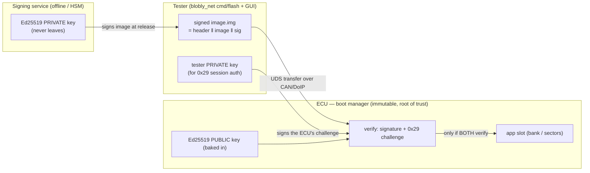
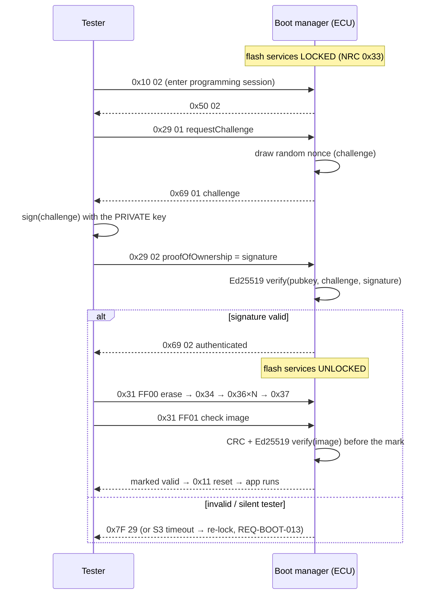

# Bootloader — design + build log

> Status (2026-07-16): **P1–P3 + P5 BENCH-VERIFIED on the H755; P4 (atomic activation) pending.**
> The chain runs on real silicon: header-verified jump, CAN reflash + torn-image
> recovery, S3/return-to-app session timers, and full asymmetric authenticity —
> Ed25519 image signatures verified on the CM7 (no heap) + a 0x29 session gate
> backed by the STM32H7 hardware TRNG. flash.c is silicon-proven. See the bench
> logs at the bottom. Crypto lives in `bcrypto/` (SHA-512 + Ed25519, RFC-vector
> verified); signing is host tooling (`tools/mkimage --sign`, `examples/keys`).

## Goal

In-field application update over the diagnostic transports, unbrickable at every step.
**CAN (ISO-TP) is the first transport binding; nothing in the design may close the door
on Ethernet (DoIP)** — the same rule the trace dump already lives by: end-of-stream and
structure live in the FORMAT and the SERVICES, never in a transport's timing or framing.

## Shape: a small immutable boot manager + the blobly stack it already has

Two pieces, not one:

```
flash ┌────────────────┬──────────────────────────────────────────┐
      │ boot (≤32 KB)  │ application image(s)                     │
      │ never updated  │ [header | vectors | code ...]            │
      │ in the field   │ header: magic, length, crc, version, ... │
      └────────────────┴──────────────────────────────────────────┘
```

- **boot** — a bare-metal V freestanding image (no ThreadX, one superloop: exactly the
  shape `examples/h735_app` already proves). It owns the boot decision, the flash
  driver, and the programming session. Small enough to review, boring enough to never
  touch again (REQ-BOOT-008: the app-update flow cannot write its region).
- **application** — any blobly image as built today, plus an **image header** the build
  emits and the boot manager verifies.

Reuse, not invention: `driver/can` + `comm/isotp` + `comm/uds` are the programming
stack; the boards layer owns flash geometry/erase/program (a `boards/<b>/flash.c` the
way clocks/pins are owned today); ecu.toml grows a `[boot]` block bound by loom2v like
every module (`docs/com-modules.md` rules).

## Boot decision (REQ-BOOT-001/002/003/010)

```
reset → boot manager:
  1. programming request pending?   (magic in a no-init RAM cell, written by the app,
     └─ yes → stay in bootloader        cleared on read — the dtrace-cell pattern)
  2. app header valid && crc ok?
     └─ no  → stay in bootloader    (REQ-BOOT-002: never jump into half an image)
  3. jump to app                    (bounded delay: no bus wait on the happy path)
```

The app side of (1) is one UDS service the application already speaks: `EcuReset /
programming session` → write the request cell → reset. That is REQ-BOOT-003 with no
new machinery — the request cell is the SRAM4-handshake pattern from the dual-core
work, aimed at a reset instead of a second core.

## The handoff, both directions

**Boot → app: the jump only ever happens from near-reset state.** On the happy path
boot has touched NOTHING before deciding — no PLL, no CAN, no interrupts enabled;
reading a RAM cell and CRC-ing flash needs only reset defaults. So the direct jump is
clean by construction: set VTOR to the app's vector table, load MSP from its word 0,
jump to its reset vector. The app is linked at the app-region base and its startup is
unchanged; any later reset lands back in boot by hardware (boot owns the boot address).

The one state-laden case — after a programming session (CAN up, clocks configured,
a diagnostic session to tear down) — **never jumps**: it writes its result and
self-resets, and the next cycle takes the virgin happy path. Peripheral-state leakage
into the app is eliminated by construction, not managed by a deinit checklist.

**App → boot** is the request cell above; **information forward** is its sibling: a
`boot_info` no-init cell (boot reason — normal / freshly-flashed / was-invalid,
bootloader version) written by boot before the jump, exposed by the app over a
DID/shell command without re-deriving anything. Both cells live in one board-owned
header (the `duo.h` pattern) and are bound in `[boot]` so generator, app, and boot
manager cannot disagree on the addresses.

**Dual-bank caveat for P4:** a full-bank swap swaps the bootloader out with the app —
so bank-swap activation means either boot duplicated at the base of BOTH banks, or
no-swap with per-bank-linked images and a boot-side bank choice. Named now, decided
in P4 with the silicon on the bench.

## Programming session (REQ-BOOT-005/006/009)

Plain UDS, because it is already transport-neutral by construction:

| step | UDS service | notes |
|---|---|---|
| enter | 0x10 programming session | boot manager answers; app forwards + resets (above) |
| identify | 0x22 read DID | bootloader + app version/validity (REQ-BOOT-009) |
| authenticate | 0x29 Authentication | challenge/response; the tester signs, the boot verifies with its public key (REQ-BOOT-016) |
| erase | 0x31 routine: erase region | region = app area only (REQ-BOOT-008 enforced here) |
| transfer | 0x34 / 0x36 × N / 0x37 | block-wise, per-block ack (ISO-TP flow control does the pacing on CAN; DoIP brings its own) |
| verify | 0x31 routine: check image | full-image CRC (+ signature when REQ-BOOT-011 lands) — only THEN is the header's valid mark written (REQ-BOOT-005) |
| go | 0x11 ECU reset | boot decision runs again, now finds a valid image |

`comm/uds` today serves DIDs; the bootloader adds 0x10/0x29/0x31/0x34/0x36/0x37/0x11 —
services the host side (blobly_net) already knows how to
drive. The host flasher is a blobly_net `cmd/` tool speaking the same modules.

**Transport neutrality in practice:** the boot manager talks to `uds.Server` through
the same endpoint-binding seam every ComModule uses. ISO-TP/CAN is binding #1; a DoIP
binding is a second transport handing the same byte streams to the same server —
blobly_net already carries a `doip` module for the host half. No service, block
format, or session state may reference frame sizes or bus timing (REQ-BOOT-006);
block size is the transport binding's business, exactly like the trace dump's
`pack_chunk(cap)`.

## Atomic activation (REQ-BOOT-007) — two strategies, one requirement

The requirement is instance-agnostic; the boards layer picks the strategy the silicon
affords:

- **Dual-bank parts (H755, H743...):** program the inactive bank, verify, then flip
  the bank-swap option bit — activation is one atomic hardware bit; rollback is
  flipping it back. The H755 bench board is the natural first target.
- **Single-bank parts (H735):** erase-then-program in place; "atomic" degrades to
  "valid mark written last" — an interrupted update leaves an invalid header, the boot
  manager keeps the ECU in programming mode (REQ-BOOT-004), and the previous app is
  gone but the ECU is not bricked. Honest, documented downgrade — same rule as the
  lean codec: fail loudly, never half-work.

## Image container (the contract between build and boot)

`tools/mkimage` wraps a raw application `.bin` into the container the host flasher
transfers and the boot verifies:

```
  offset  field                                         written by
  ┌──────────────────────────── header word 0 (signed) ───────────────────────┐
   0      magic       u32  'BLBT'
   4      hdr_ver     u16  = 1
   8      image_len   u32  bytes of the app image (excludes header + signature)
  12      image_crc   u32  CRC-32 of the image (fast bit-rot pre-check)
  16      sw_version  u32
  20      hdr_size    u32  = 64
  28      word0_crc   u32  CRC-32 over bytes 0..27 (header self-check)
  ├──────────────────────────── header word 1 ────────────────────────────────┤
  32      valid_mark  u32  'VALD'  ← the boot writes this LAST, after verifying
  36..63  reserved (0xFF)
  └────────────────────────────────────────────────────────────────────────────┘
  64                    image  (image_len bytes; --pad-vectors puts vectors @ +0x400)
  64+image_len          signature  Ed25519, 64 bytes  ← --sign; over header[0..32] ‖ image
```

Two words by design: the **valid mark lives alone in word 1** so it can be programmed
last (a torn update leaves an *invalid* header — unbrickable, REQ-BOOT-005). The
**signature covers header word 0 ‖ image** — so `image_len`, `image_crc`, and
`sw_version` are all bound and cannot be tampered — and is excluded from what it
signs (the valid mark is the boot's to write). `[boot]` in ecu.toml binds the
request-cell address, app region, and DIDs so generator, app, and boot agree on the
layout — one config, as always.

Build invocations:

```sh
# field image — the boot verifies the signature and marks it valid itself
v run tools/mkimage app.bin app.img <ver> --pad-vectors --sign examples/keys/mkimage.seed

# factory image — pre-marked, SWD-only, physical-trust path (no --sign; the two
# are mutually exclusive: pre-marking would bypass the signature check)
v run tools/mkimage app.bin app.img <ver> --pad-vectors --valid
```

## Trust model — what the tester holds vs what the ECU holds

Asymmetric all the way down (P5): the **private key never touches an ECU or a build
machine** — a signing service / HSM owns it. Every device only holds the **public**
key and can *verify* but never *forge*. The boot manager is the **root of trust**:
it's the small immutable stage that holds the key and gates both the image and the
session.



Two independent gates, both anchored in that one public key:

- **Session gate (0x29)** — before any erase/download, the tester proves it holds a
  private key by signing an ECU-chosen random challenge (below). Stops an
  *unauthorised* tester from starting a reflash.
- **Image gate (signature)** — the boot verifies the image signature before writing
  the valid mark, and (as `check_and_mark`) rejects an unsigned or wrongly-signed
  image. Stops a *tampered or forged* image from ever booting, even if the session
  gate were somehow bypassed. This is the last line of defence.

> Key separation: this stack uses **two** dev keys, named for their consumer
> (`examples/keys`): `mkimage.seed` (the **release** key — signs images, verified by the
> boot's `image_key`) and `tester.seed` (the **tester** key — authorises 0x29 sessions,
> verified by the boot's `session_key`). Different custody, different blast radius: leak
> the tester key and someone can *start sessions*; leak the release key and someone can
> *forge firmware*. Production keeps the release seed in a signing service/HSM and the
> tester seed with the technician (ideally per-technician PKI, not a shared file).

## Session authentication — UDS 0x29 (REQ-BOOT-016)

The boot's flash-write services (erase/download/transfer) are locked until the tester
authenticates. `0x29` replaces the legacy `0x27` seed/key: instead of a shared secret,
the ECU issues a random challenge and the tester returns a **signature** over it, which
the ECU verifies with the public key it already holds. Nothing extractable from an ECU
lets an attacker forge it.



Note the two verifications are distinct: 0x29 authenticates the **tester** (a live
challenge, so a captured session can't be replayed), and `check image` authenticates
the **image** (a signature over the bytes). Both must pass.

## Threat model — what P5 covers, and what it does not (yet)

Being precise so "signatures verified" is not mistaken for "fully locked down."

**P5 guarantees** — rooted in a public key the ECU holds:

- **Image authenticity/integrity.** A forged, tampered, or unsigned image cannot
  boot: the boot verifies the Ed25519 signature before writing the valid mark.
- **Session authorisation.** An unauthorised tester cannot start a reflash: the
  0x29 challenge/response admits only a private-key holder, and the live
  challenge defeats replay.

**Not covered yet** — each is a *layer on top*, not a flaw in the crypto:

1. **Replacing the root of trust itself.** The boot manager and its baked key are
   immutable only *by convention* — the app-update path cannot write the boot
   region (REQ-BOOT-008), but SWD/JTAG still can. An attacker with debug access
   could reflash the boot and swap the public key. Closing this needs the
   silicon's own mechanisms — **RDP level 2** (disables the debug port,
   irreversible), **write-protecting the boot sector**, and, where the part
   provides it, **secure-boot option bytes** that make the ROM verify the boot
   manager at power-on. That completes the chain (silicon → boot → app); today we
   built only the boot → app link. **REQ-BOOT-018**; a hardware-config phase (P6),
   validated on a *sacrificial* board because RDP2 cannot be undone.
2. **Private-key custody.** In dev the signing seed is a file (`examples/keys`).
   Production keeps it in an HSM / KMS on the signing side; the ECU is agnostic
   (it verifies with a public key) — swap the signer, the boot test is unchanged.
   The `$BLOBLY_FLASH_SEED` seam is where that swap happens.
3. **Rollback.** A validly-signed *old* image (with a since-fixed vulnerability)
   still verifies. `sw_version` is in the header but nothing enforces
   monotonicity; anti-rollback (a stored minimum version) is a future rung.
4. **Confidentiality.** Images are signed, not encrypted — the firmware is
   readable on the wire and in flash. If IP protection matters, add image
   encryption (a separate concern from authenticity).

### Trust anchor: a raw key today, certificates later

The boot holds **one raw Ed25519 public key**, baked in — the simplest trust
anchor ("trust exactly this key"), the same model as an SSH `authorized_keys`
entry or verified-boot with an embedded key, and common in embedded secure boot.

The mainstream automotive answer is **X.509 certificates**, and *real* UDS 0x29
uses them: its `verifyCertificateUnidirectional`/`Bidirectional` sub-functions
transmit a certificate the ECU validates against a stored **root CA** before the
challenge/response. This stack implements a **simplified 0x29 profile** that skips
the certificate and uses the raw key directly. What a certificate chain would buy,
and why it is deferred:

- **Rotation / revocation** without reflashing every boot: rotate a leaf/
  intermediate; the ECU trusts anything the CA vouches for. A single baked raw key
  means a compromised key ⇒ reflash all boots.
- **Delegation** to multiple *limited* signers — per-plant, per-supplier, or a
  per-technician key for 0x29 — all trusted via one root the ECU stores.
- **Identity + metadata** — validity periods, key-usage constraints the ECU checks.

The cost is why it is not here first: **ASN.1/DER parsing is heavy and a real
attack surface** (cert-parser bugs are a CVE genre), and a full chain drags in
more crypto. A minimal cert format, or rotation via a signed *key-list*, is a
lighter middle ground if the trade pinches before a full PKI earns its way in.

## Phasing (each rung bench-verified, as usual)

1. **P1 — boot manager skeleton** on the H755: header check + jump + request cell;
   no comms yet. Proves the layout and the decision logic.
2. **P2 — CAN programming session**: ISO-TP + UDS erase/transfer/verify on the bench;
   host flasher tool in blobly_net. First real reflash over the wire.
3. **P3 — app-side handoff**: programming session request from the running
   application (NM-aware: hold the bus awake during the session).
4. **P4 — atomic activation** (REQ-BOOT-007, instance-agnostic): the requirement is
   "run the whole old or the whole new image, never a mixture." *Implementation note*
   — the boards layer picks the strategy the silicon affords: dual-bank swap on
   parts that have it (H755/H743), the valid-mark-last degrade on single-bank parts
   (H735). The requirement names neither; see "Atomic activation" above.
5. **P5 — authenticity** (REQ-BOOT-011/016): asymmetric (Ed25519 + SHA-512, the
   no-alloc `bcrypto/` module, RFC-vector verified). **Both rungs done and
   bench-verified** — image signing (verify before the mark) *and* the 0x29
   session gate (challenge/response, TRNG-backed), with the release and tester
   keys separated (see the trust model + sequence above). Key management (the
   private keys off every ECU) is a deployment concern the design names but does
   not own.
6. **P6 — hardware root of trust** (REQ-BOOT-018): RDP2 + boot-sector write
   protection + secure-boot option bytes, so the verifier itself can't be swapped.
   Irreversible — validated on a sacrificial board. Optional siblings: a
   certificate chain (rotation/revocation/delegation), anti-rollback, image
   encryption — each earns its way in against the threat model above.
7. **Ethernet/DoIP binding** when hardware with Ethernet lands — by construction a
   new binding, not a redesign.

## Non-goals (now)

- Bootloader self-update (field-updating the updater — needs the dual-image dance
  applied to boot itself; revisit when a real deployment demands it).
- Delta/compressed updates, multi-image orchestration across cores (the satellite
  image rides the owner's flash banks for now).
- Production key management (P5 notes the seam; a deployment owns the keys).

## Entering programming mode — production practice vs this stack

Production bootloaders wrap the entry and the session in layers this stack
implements partially (by design — each deferred layer has a named seam). The
map, so nobody mistakes the bench workflow for the field workflow:

**1. Pre-conditions (before entry).** An OEM application refuses the switch to
programming mode unless the vehicle state allows it — speed = 0, engine off,
battery voltage in a safe window, transmission in park — answering NRC 0x22
(conditionsNotCorrect) otherwise. In this stack the entry request is the app's
`boot` shell command (bootcell + reset), and today it is UNCONDITIONAL — a
bench tool. The gate belongs to the application layer (only the app knows its
state model), which is exactly the mode-management seam: a production app
gates the bootcell write on its own safe-state signal (REQ-BOOT-015 names
this; the boot manager itself cannot know vehicle state and never will).

**2. Entry strategy.** The two production shapes are unlock-the-app-first
(0x27 to the application, then 0x10 02 triggers the reset) and
authenticate-in-boot (free transition, locked bootloader). This stack is the
second shape: the app's entry path carries no authentication, and every
write/erase service in the boot refuses (NRC 0x33) until the in-boot
SecurityAccess handshake passes. A production deployment layering UDS into
the application would likely move to the first shape — the bootcell transition
flag is already the mechanism both shapes share.

**3. Session discipline (ISO 14229 timers).** The programming session dies
after 5 s of tester silence (S3server, REQ-BOOT-013): back to the default
session, security re-locked, a half-done download abandoned. And a boot
entered BY REQUEST over a valid app returns to the application after a
bounded quiet window (REQ-BOOT-014) — a dead tester must not park the ECU in
boot until power-off. TesterPresent (0x3E) keeps a session alive through
longer tester-side pauses.

**4. Authentication (0x27 today, 0x29 at P5).** The seed/key here is a
placeholder pair sharing one function with the host (`expected_key` — the P5
replacement point). Production practice: a DEDICATED security level for
flashing (distinct from any application diagnostics level), and increasingly
UDS 0x29 Authentication — a PKI challenge/response (the tester signs the
ECU's random challenge; the boot verifies against an OEM public key in
protected storage) per ISO/SAE 21434 expectations. P5 (REQ-BOOT-011) covers
both rungs: real seed/key material first, 0x29 + signed images when a
deployment demands them.

**5. The last line: image verification before the mark.** Independent of any
session security, the check routine (0x31 FF01) hashes the flashed image and
only THEN writes the valid mark — today a CRC-32 (integrity), at P5 a
cryptographic signature (authenticity), same choreography. A tester that
somehow bypassed every session barrier still cannot make the boot manager run
an image that fails this check; a torn or tampered transfer leaves an invalid
header the decide() path refuses forever.

## Bench log — P5 authenticity, 2026-07-16 (H755)

The full asymmetric chain on real silicon:

- **Ed25519 image signature** verified on the CM7 before the mark: a
  `mkimage --sign` image (51 KB, dev key) delivered over CAN → the boot streamed
  the image through SHA-512 + Ed25519 verify (no-alloc, no heap on the target) →
  valid mark → reset → app v10 ran. A wrongly-signed or tampered image is
  refused (no mark).
- **0x29 session gate** with the STM32H7 **hardware TRNG** as the challenge
  source: request challenge → tester signs with the dev private key → CM7
  verifies with the baked public key → flash services unlocked. A **wrong tester
  seed** is rejected with NRC 0x35 and nothing is flashed.
- The boot image is 38.6 KB (crypto included), verify path allocation-free
  (`lint_vinit` + the no-heap source guard), challenge from `board_rng` (HSI48
  kernel clock, bounded polling → conditionsNotCorrect if the RNG is dead).

Dev keys: `examples/keys/mkimage.seed` (release, verified by `image_key`) +
`tester.seed` (0x29, verified by `session_key`) — both public halves baked into the
boot. `cmd/flash` takes the tester seed from
`$BLOBLY_FLASH_SEED` or the dev default.

## Bench log — NUCLEO-H755ZI-Q, 2026-07-15 (first silicon pass)

The dry-coded chain, end to end on the H755 bench (ST-LINK + PCAN, classic 500 k):

- **P1 jump**: boot at sector 0, `mkimage --valid --pad-vectors` app at APP_BASE —
  header magic + CRC over 50 KB verified, VTOR/MSP/jump; the full ThreadX app
  (both cores, NM, telemetry, NvM persist) runs linked at `APP_VECTORS`. The app
  side is one make flag: `make APP_LINK=boot` (defsym-driven FLASH origin).
- **app→boot rung**: the `boot` shell command writes the SRAM4 request cell and
  resets; the response is deliberately lost to the reset (0x11-style — silence is
  the ack). Boot takes the request and stays.
- **P2 CAN reflash**: session → seed/key → UDS erase (0x31 FF00, real 128 KB
  sector) → 50 956 bytes in 100 ISO-TP blocks → on-target full-image CRC (0x31
  FF01) → valid mark written → reset → the delivered app runs.
- **Pull-power mid-transfer**: flasher killed ~30 blocks in, board reset — the
  torn image (header landed, tail missing, no valid mark) is REFUSED, boot stays,
  bus silent; recovery = plain reflash from programming mode → app runs.
- **Bootcell**: NVIC-reset survival (request honored) and POR/stale-garbage
  rejection (fresh flashes jump straight to the app) both observed.

Dry-code gaps the bench found (all fixed in this pass):
1. Boot never muxed PD0/PD1 (`board_can_clock_pins_init` — `blob_can_open` does
   clocks, not pins): programming session timed out into a dead wire.
2. `Prog.seed`'s struct-field default ('BLOB') is `_vinit` work that freestanding
   never runs — the __global read seed 0, the tester took the already-unlocked
   convention and skipped the key, every guarded service NRC'd 0x33. Third
   sighting of the vlang `_vinit` trap; seed is now assigned explicitly.
3. Host side: SocketCAN's default `txqueuelen 10` drops the ISO-TP burst
   (`No buffer space available`) — `ip link set can0 txqueuelen 1000`.

Known polish (not blocking): the 0x11 positive response is lost to the immediate
reset (drain the Tx FIFO first); `st-flash erase` mass-erases — never use it for
a single sector on a populated part.
