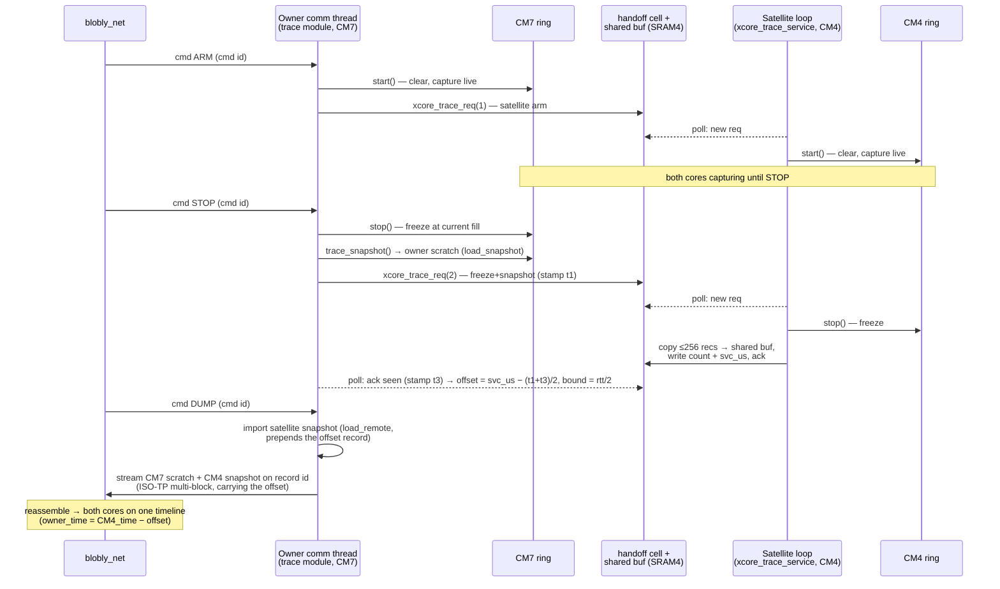

# On-board trace — capture, gather, dump

How the runtime trace is captured per core, gathered from every core to the bus owner, and
streamed off the board. The short version: **each core keeps its own flight-recorder ring in its
own memory; the owner asks each satellite to copy its ring into one shared buffer, aligns the two
clocks, and the owner's comm thread is the only thing that ever puts trace on the bus.** For the
capture *mechanism* (the ThreadX hooks + the Loom hook) see the first section; for the cross-core
region this rides in see [xcore.md](xcore.md).

## What gets captured, and how (not special — existing seams)

Records captured into the ring are 8 bytes in one wire format, from two sources:

- **Thread swaps** — ThreadX's built-in **execution-change hooks**. Built with
  `-DTX_ENABLE_EXECUTION_CHANGE_NOTIFY`, the M7/M4 port calls `_tx_execution_thread_enter/exit` on
  *every* context switch (and the port brackets the SysTick tick). `boards/common/trace_hooks.c`
  just **implements those callbacks** — no scheduler instrumentation of our own.
- **ISRs** — *not* automatic for every interrupt. The port gives you the SysTick, but an
  application ISR is captured only if it **brackets itself** in `_tx_execution_isr_enter/exit` —
  which the FDCAN Rx and HSEM handlers in `comm_glue.c` do. A new ISR wired straight into the
  vector table without those calls (or a wrapper that adds them) will **not** appear in the trace.
- **FB dispatch** — the Loom's own hook. The generated run loop calls `sched.run_profiled(clock)`
  and sets `trace_fb_hook_<thread>`, so each due handler is bracketed (`t0`, `dt`) and pushed as a
  record. A clean seam on the existing dispatch loop.

These push into the *same* ring on the *same* timebase (`trace_now_us()`), so a dump reads
`thread A → FB X enter → FB X exit → ISR (comm rx) → … → swap to thread B` as one interleaved
timeline. (Host caveat: the ThreadX **Linux** port doesn't call the execution-change hooks — they
exist for the real M7/M4 ports only — so real context-switch capture is a *target* feature; the
host relies on the FB hook + its polled model.)

Two record *classes* reach the host: the **THREAD / ISR / FB** records above, captured live in the
rings, and **CONTROL** records (`ctl_block`, `ctl_epoch`, and — for an imported satellite window —
`ctl_coreoffset`) that the packager *prepends* to each streamed chunk at dump time. A decoder must
treat CONTROL records as metadata (block framing, the epoch base, the core offset), not as workload
events.

## Where the buffers live

| Buffer | Where | What |
|---|---|---|
| the **ring** (per core) | `g_ring[256][8]` — a `static` in that image's `trace_hooks.c`, in **that core's own** bss/SRAM | the flight recorder each core fills; overwrites oldest |
| the **handoff cell** | `XCORE_TRC_ADDR` in shared SRAM4 | `{req_seq, op, ack_seq, count, svc_us}` — the owner↔satellite control channel |
| the **shared record buffer** | `XCORE_TRC_BUF_ADDR` (256×8) in shared SRAM4 | where a satellite copies a *snapshot* of its ring for the owner to read |

So the rings themselves are **private** — the only cross-core trace memory is the small handoff
cell and the one shared snapshot buffer. A satellite's ring is never mapped into the owner; it is
*copied* into the shared buffer on demand.

## Who sends it

**The bus owner's comm thread — and only it.** A satellite never touches the bus for trace: it
merely copies its own ring into the shared buffer when asked (in its normal app loop, via
`xcore_trace_service`, ~one poll per tick). The owner freezes its own ring, imports each
satellite's snapshot over the handoff, aligns the clocks, and streams every record out on the
trace `record` id.

## The dump sequence

Three **distinct** host commands drive it — `ARM`, `STOP`, `DUMP` (opcodes in
`comm/trace/control.v`). They are separate presses, not one: capture runs live between ARM and
STOP, the **freeze + both-core snapshot happens at STOP**, and DUMP only *streams* an
already-frozen buffer — a DUMP sent before a STOP returns `NOT_READY` (`handle_cmd` only dumps a
`.full`/`.frozen` buffer).



## Does the dump block the bus? No — it interleaves

The comm loop calls each producer's `produce()` once per pass, and the trace `produce()` emits **at
most one frame** then returns. The dump keeps a **cursor** that persists across passes (`dump_pos`
for the raw stream; `local_from` / `remote_from` for the ISO-TP block dump), so a full dump streams
**one frame at a time over many loop iterations**. On those same passes the comm thread still drains
rx, sends telemetry, sends cyclic signals, and runs NM — all at their normal cadence; on a multi-bus
owner the other buses keep forwarding too, because the loop **never blocks** inside the dump. Two
further brakes: the ISO-TP dump only advances on the host's **flow-control** frames (`dump_fc`), so
the host paces it, and every send is **`tx_ready`-gated**, so real traffic gets the tx slot first.
The deliberate trade-off is that a dump takes *longer* (spread thin) rather than *freezing* the bus
— the ECU keeps running its real traffic while it hands out a diagnostic capture.

## The clock correlation (why the two cores line up)

Each core counts `trace_now_us()` from its *own* first tick, so their zeros differ. The snapshot
round trip measures the gap: the owner stamps **t1** as it releases the request, the satellite
stamps **svc_us** as it services (the middle of the exchange), the owner stamps **t3** when it
first sees the ack. Then

    offset = svc_us − (t1 + rtt/2)     bound = rtt/2       (rtt = t3 − t1)

is the satellite-minus-owner skew, so the host maps a satellite stamp onto the owner's clock by
**subtracting** it — `owner_time = satellite_time − offset` (`comm/trace/trace.v::new_core_offset`)
— with a residual uncertainty the host *shows* rather than rounds away. If no round trip has closed — or the modular u32 math admits an implausible >60 s skew (a
restart aliasing across the ~71-min wrap) — the owner emits **no** correlation, so the host shows
"not measured" instead of a confident lie. (A 64-bit svc stamp is the real close-out, bench-queued.)

## Config

The `[trace]` block names the four CAN ids and the depth:

```toml
[trace]
enabled        = true
bus            = "can0"
level          = "all"     # "all" uses run_profiled (per-FB brackets) on top of the swap hooks
buffer_records = 256       # = the ring depth (trace_hooks.c RING_CAP)
mode           = "ring"    # flight recorder: overwrite oldest
cmd            = 0x7E8     # host -> owner: arm / stop / dump (+ a core_mask, see below)
rsp            = 0x7E9     # owner -> host: why capture stopped, counts
record         = 0x7EA     # owner -> host: the record stream (ISO-TP, multi-block)
dump_fc        = 0x7EB     # host -> owner: ISO-TP flow control for the stream
```

**`core_mask` caveat.** Bit *i* of the mask (cmd `data[6..7]`; `0` defaults to core 0) selects which
cores act. It gates the per-core *module* buffers (`Cmd.targets` in `control.v`) and which
satellite is forwarded to (`data[6] & 0x02`). It does **not** gate the owner's exec-hook C ring:
the generated owner (`trace_rx_arms`) arms/freezes/snapshots that ring on *any* trace cmd, before
the masked `on_cmd`. So there is no way to re-arm just the satellite — an ARM addressed at the
satellite alone still clears the owner's live capture.

Nothing here is semihosting or a debug probe — the board dumps its own trace over CAN and runs
standalone (see [xcore.md](xcore.md) for the region, [telemetry.md](telemetry.md) for the live
CpuLoad path that shares the comm thread).
