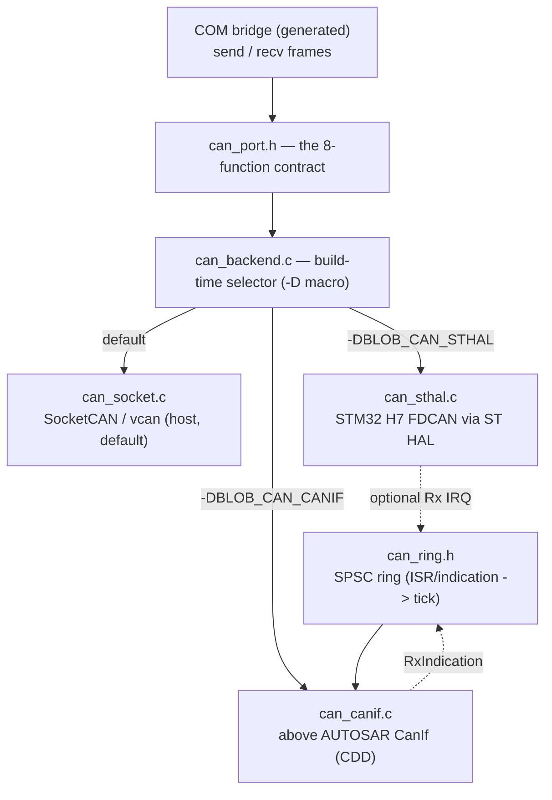

# Porting — the platform line (CAN driver + OSAL)

Everything above `driver/` and `osal/` is platform-independent V. Porting blobly
to a new target means filling in **one CAN backend** and **one OSAL backend** — the
framework, the generated code, and the application FBs never change. This is the
seam, how to pick a backend, and what each one has to provide.

## The CAN driver port

The whole contract the COM bridge depends on is eight C functions
([driver/can/can_port.h](../driver/can/can_port.h)):

```c
int      blob_can_open (const char *name, int fd_mode);                 /* >=0 handle, -1 fail */
int      blob_can_send (int h, uint32_t id, const uint8_t *d, uint8_t len, int flags);   /* flags: BLOB_CAN_FLAG_FD|EXT */
int      blob_can_tx_ready(int h);                                      /* 1=Tx can accept now, 0=full */
int      blob_can_tx_idle (int h);                                      /* 1=all handed-off frames transmitted */
int      blob_can_recv (int h, uint32_t *id, uint8_t *d, uint8_t *len, int *flags); /* 0=frame (flags=FD|EXT), -1=none */
uint32_t blob_can_rx_overruns(int h);   /* count of Rx-overrun events since open, each >=1 frame lost */
uint32_t blob_can_busoff_recoveries(int h); /* count of bus-off recoveries since open; 0 where the platform owns it */
void     blob_can_close(int h);
```

The `flags` word carries the per-frame format: `BLOB_CAN_FLAG_FD` (CAN-FD vs classic)
and `BLOB_CAN_FLAG_EXT` (29-bit extended vs 11-bit standard id). `send` reads them from
the caller's frame; `recv` reports them for the received frame. A backend must **drop
REMOTE (RTR) frames** in `recv` (return "none") — the `Frame` has no RTR flag, so a
forwarder would otherwise emit a data frame with meaningless bytes.

`blob_can_busoff_recoveries` surfaces bus-off recovery (REQ-CAN-DRV-009): a backend that owns
the controller re-initiates bus participation after bus-off and counts it; a backend where the
platform owns recovery (SocketCAN's kernel `restart-ms`, a CanIf CDD above CanSM) returns 0.

`blob_can_rx_overruns` surfaces receive-with-loss (REQ-CAN-DRV-008): when frames arrive
faster than `recv` drains them and overflow the Rx buffer, the backend counts the overrun
**events** (a monotonic loss indicator — one hardware overrun flag can cover several
dropped frames, so it's a lower bound, not an exact frame total) rather than dropping
silently. Each backend reports it from its own overflow source: FDCAN counts `IR.RF0L`
(Rx-FIFO0 message lost), the ST HAL `FDCAN_FLAG_RX_FIFO0_MESSAGE_LOST`, the CanIf CDD its
SPSC-ring push failures, and host SocketCAN the `SO_RXQ_OVFL` per-socket drop count.

`blob_can_tx_ready` is the non-blocking back-pressure query: return 1 only when `send`
can accept a frame right now (e.g. the Tx FIFO has a free slot). A burst sender (the
ISO-TP dump / UDS response) gates on it — `for tx_ready() && link.poll(...) { send() }` —
so it never overruns the FIFO and never blocks; `send` itself must stay non-blocking
(report full, don't spin). Report it as accurately as the backend allows: FDCAN checks
`TXFQS.TFQF`, host SocketCAN polls `POLLOUT`; a backend that can't pre-query (e.g. CanIf,
which owns its own Tx buffering) returns 1 and relies on that buffering being sized for
the worst case.

It is **polled** on purpose: the bridge is tick-driven, so `recv()` returns the next
queued frame or "none". `can.v` calls exactly these and is backend-agnostic; the
generated `gen/loom_gen.v` only ever touches `can.Channel`.



### Picking a backend

`can.v` compiles one translation unit, `can_backend.c`, which `#include`s exactly
one backend chosen by a `-D` macro. With no macro you get the host SocketCAN build,
so the examples and the blobly_net tests are unaffected.

| Target | Build flag | Backend |
|---|---|---|
| host / sim (vcan) | *(none)* | `can_socket.c` — Linux SocketCAN |
| STM32 H7, no AUTOSAR | `-cflags '-DBLOB_CAN_STHAL -I<ST HAL inc>'` | `can_sthal.c` — FDCAN via ST HAL |
| AUTOSAR ECU (vendor BSW) | `-cflags '-DBLOB_CAN_CANIF -I<BSW inc>'` | `can_canif.c` — CanIf CDD |

The target backends are only compiled when their macro is set (and their SDK is on
the include path), so they can never break the host build. The bus identifier is the
`name` argument: a netdev (`"vcan0"`) on SocketCAN, a bus index (`"0".."2"`) on the
targets — passed from the example's `main.v` (the one hand-written, platform-aware file).

### Two integration shapes

**You own the driver (ST HAL).** `can_sthal.c` talks the FDCAN peripheral directly:
`send` → `HAL_FDCAN_AddMessageToTxFifoQ`, `recv` → poll Rx FIFO0. CubeMX
(`MX_FDCANx_Init`, called from `main.v`/startup) sets the clock tree, GPIO AF, and
nominal+data bit timing; the backend just starts/stops and moves frames. On the
**STM32H735G-DK** the three FDCAN instances are wired to onboard 3V3 CAN-FD
transceivers at the board edge, so bus `"0".."2"` are three real CAN-FD connectors
with no extra transceiver — wire one straight to a PCAN/Kvaser and the blobly_net
tests run unchanged.

**You plug in above CanIf (AUTOSAR).** On a vendor BSW you do **not** own the Can
driver/MCAL — CanIf does. blobly integrates as a **CDD / CanIf user**:
`send` → `CanIf_Transmit(TxPduId, …)`; on rx, CanIf calls `Blobly_RxIndication`,
which (in ISR/BSW context) only **pushes into a per-bus SPSC ring**
([can_ring.h](../driver/can/can_ring.h)) that `recv()` drains on the bridge tick.
So application code never runs in CanIf/ISR context — the ring is the ISR↔task
boundary, the same single-producer/single-consumer discipline that makes the IOC
safe. Because `CanIf_Transmit` takes a `PduId` (not a CAN id) and rx arrives as an
`RxPduId`, the backend keeps two small **(bus,id)↔PduId tables** filled from the ECU
extract — the only per-ECU code; everything above is the generated, portable stack.

## The OSAL backend (the other half)

Same pattern for cores / time / the IOC region. The host/sim ("vcan") side is POSIX
and stays the default backend; the targets supply their own:

| Target | Cores | `now_us` | IOC region |
|---|---|---|---|
| host / sim | `fork` + pin per partition | `clock_gettime` | `mmap(MAP_SHARED)` |
| STM32 H7 (no AUTOSAR) | bare M7 (+M4 on dual-core) / ThreadX AMP | DWT cycle counter | shared SRAM |
| AUTOSAR ECU | Os tasks + SchM schedule | GPT / Os counter | shared section |

A single-core target (the H735) runs the whole stack — COM, ISO-TP/UDS, E2E/SecOC,
the Loom and FBs — on one core; the cross-core IOC simply collapses to local cells.
The dual-core story (AMP, lock-free IOC across cores) needs a dual-core part (e.g. an
H755).

## What a new port actually costs

1. `driver/can/can_<backend>.c` — implement the six `blob_can_*` functions.
2. `osal/osal_<backend>.c` — cores, `now_us`, the shared IOC region.
3. `main.v` — the platform init (HAL/CubeMX or `Can_Init`/`CanIf_Init`) + `gen.run`.

No framework, no codegen, no FB changes. Build with the matching `-cflags -D…` and
the target SDK on the include path.
