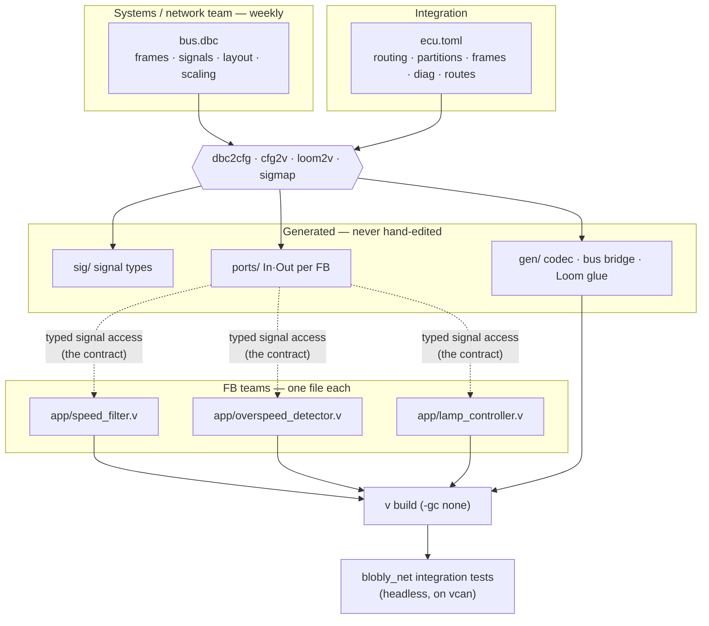
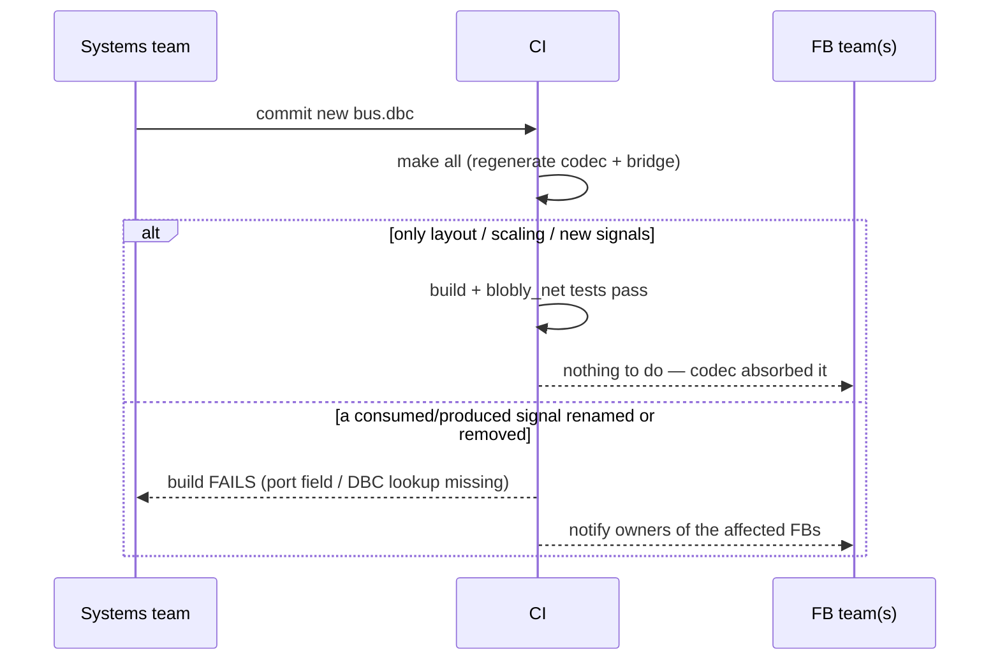

# Ways of working — many teams, a weekly DBC, parallel FBs

How a real project runs on blobly: several **FB teams** (often one or two people per
Function Block), an **integration** owner of the wiring, and a **systems / network**
team that drops a fresh **DBC** every week. The architecture is built so these run in
parallel and the weekly DBC churn doesn't ripple into application code.

## The one rule that makes it work: the signal *name* is the contract

An FB is a pure function of **named, physical** input signals to output signals
(`docs/application-model.md`). It never sees bits, byte offsets, scaling, or which
bus a signal lives on — all of that is in the DBC and absorbed by the **generated**
codec at the COM boundary.

So the interface between teams is just the **set of signal names** (and their units):

- The **systems team** guarantees those names in the DBC.
- **FB teams** code against those names.
- Everything in between — bit layout, factor/offset, frame packing, which ECU sends
  it — can change weekly **without touching a single FB**, because regenerating the
  codec re-absorbs it.

A change only reaches FB code when a signal it reads/writes is **renamed or removed**
— and that is caught at **build time** (the generated `ports` struct loses the field,
or `loom2v` errors that a signal isn't in the DBC). Fast, loud, local.

## Who owns what

| Bucket | Files | Owner | Hand-written? |
|---|---|---|---|
| **Network matrix** | `bus.dbc` | systems / network team (weekly drop) | yes |
| **Wiring** | `ecu.toml` — signals' `from`/`to`, partitions, `[[frame]]`, diag, `[[route]]` | integration | yes |
| **Application** | `app/<fb>.v` — one file per FB | FB teams (one each) | yes |
| **Platform** | `main.v` — open channels, `gen.run` | platform | yes (tiny) |
| **Generated** | `sig/`, `ports/`, `gen/` — types, ports, codec, bridge, glue | nobody (produced by `make all`) | **never** |

File-per-FB + a generated-code bucket means FB teams almost never touch the same
file, so day-to-day work is conflict-free; the one shared hand-written file is
`ecu.toml` (the wiring), which integration owns and FB teams file requests against.

## The pipeline



FBs depend **only** on the generated `ports` (typed signal access) — never on the
DBC or the bridge directly. That arrow is the whole contract.

## The weekly DBC drop



- **Re-layout a frame, rescale a signal, add new signals** → regenerate, done. No FB
  changes; the test suite confirms behaviour is unchanged.
- **Rename/remove a signal an FB uses** → the build breaks immediately, pointing at
  the exact FB. The fix is a small, owned change (rename in the FB, or integration
  re-maps the name in `ecu.toml`).

## Cross-team visibility

`make trace` regenerates `signal-map.md`: every signal's source, DBC frame, layout,
scaling, **producers** and **consumers**. It's the shared index a team uses to answer
"who reads this?" / "where does this come from?" without reading anyone else's code —
and it's generated, so it's never stale.

## CI is the integration point

Every change (a new DBC, an FB edit, a wiring tweak) runs the same gate:

```
make all          # regenerate — fails loudly if a signal contract broke
make lint         # no-alloc / partition-isolation invariants
v test comm/      # framework unit tests
make test         # blobly_net drives the real generated stack on vcan
```

Because the generators are deterministic and the tests run headless, a green CI means
the DBC, the wiring, and every FB still compose — which is exactly the thing that is
hard to keep true when many people touch one ECU.
